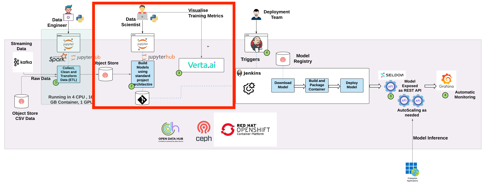
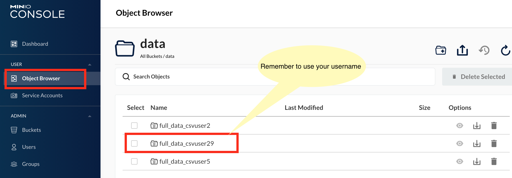
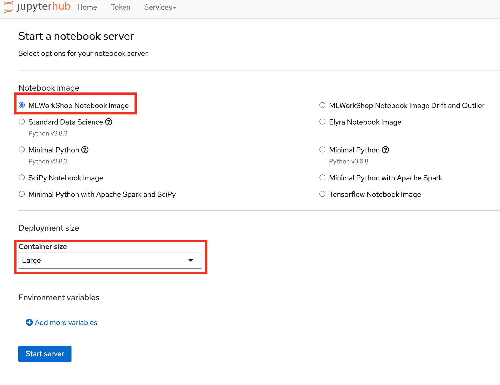
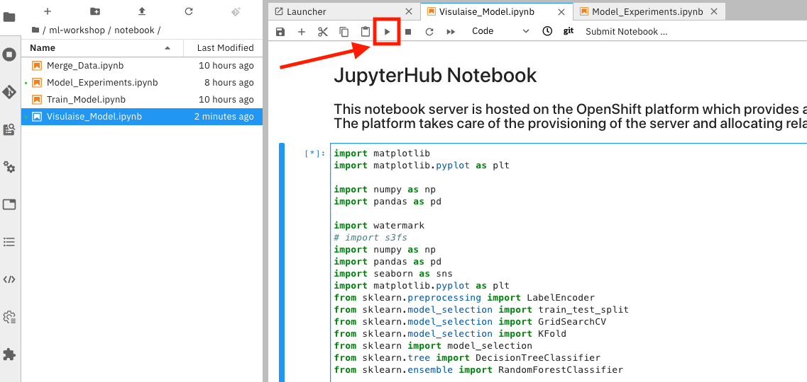
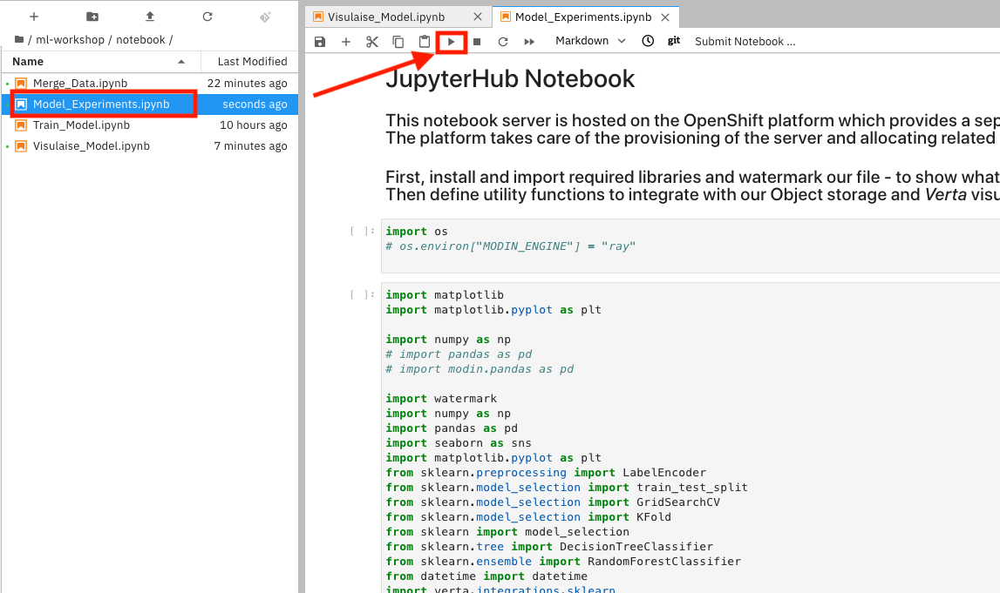
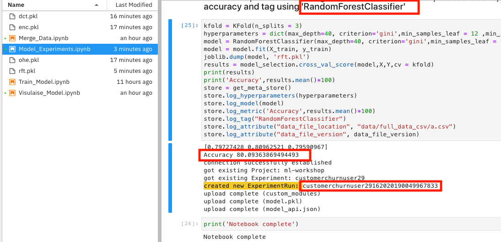
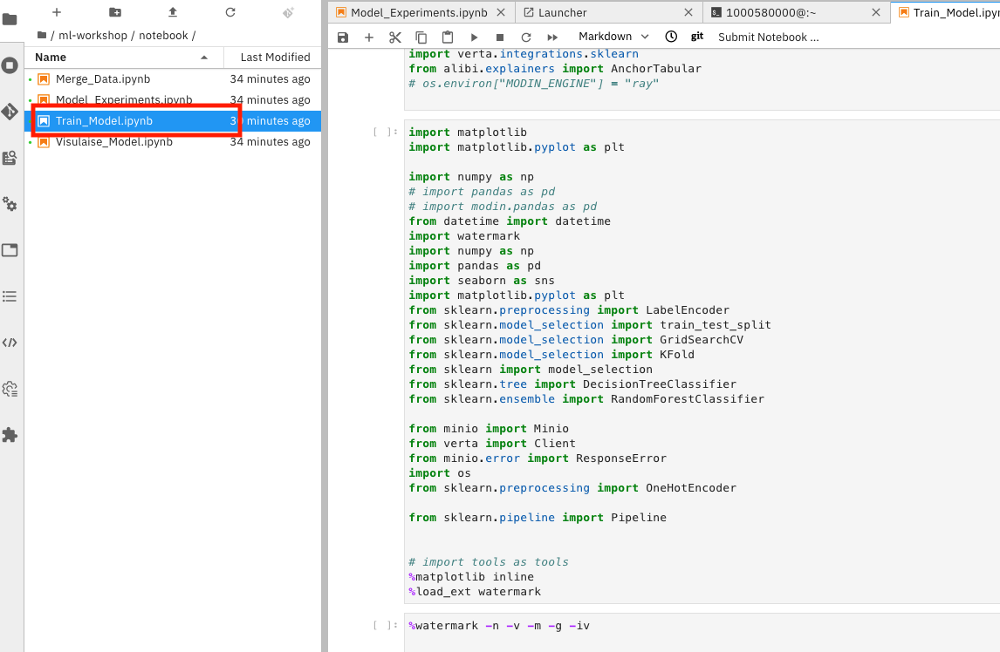
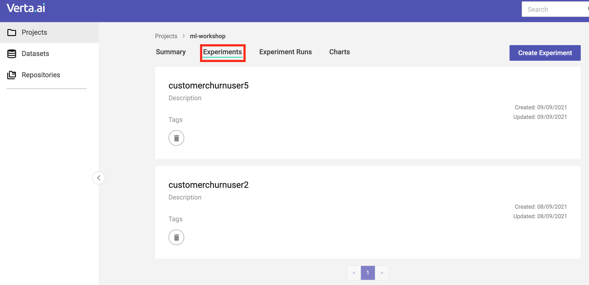
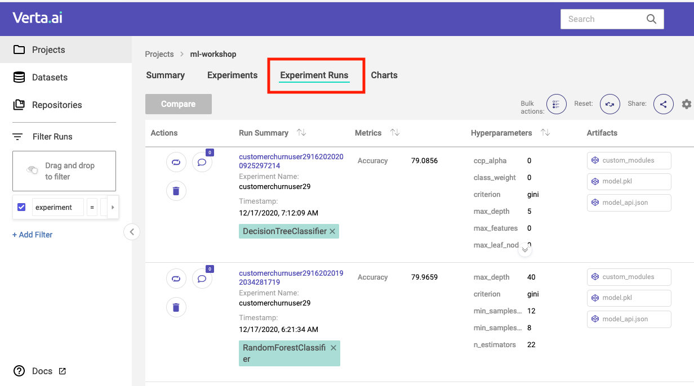

# Data Scientist visualises and analyses prepared data, experiments and trains model.

## Introduction
In our second workshop sub-module the data scientist begins their work - also with a dedicated Jupyter Notebook. They analyse and visualise the data prepared by the data engineer in the previous step.

Then then exeriment with different training algorithms, _DecisionTreeClassifier_ and _RandomForestClassifier_, and picks the best one.

Then then train the model using their selected algorithem.

This diagram highlights the flow at this stage:

## Instructions

In the last section, the data engieer's work, you pushed joined data to Object storage - as you can see in the diagram above. We need to take a record of the generated filename - as we'll be using it shortly. 

Open your Minio tab in your browser (you opened it at the start of the workshop) and click **Object Browser** in the left panel, then click on the **data** folder. 

You will see a list of everyones folders similar to the diagram below:

Locate your username and click it the *full_data_"your username"* folder .

Once you have opened your folder, click the CSV file name to open its details.

Using the example below, copy the filename, starting at "full_data" and ending at the end of ".csv"
E.g.: **full_data_csvuser29 / part-00000-07b75a3b-d460-4d5b-809a-194febfb516f-c000.csv** 

We will use this when we modify the code at a later step.We'll refer to this is **CSV-FILE** below.:

## Data Scientist visualises and analyses the data

At the end of the previous section, you logged out of JupyterHub - and you should see a screen like this:

Go ahead and start it up - and you'll again see the Spawn page - this time select the Data Science focused image, based on Elyra - which we built to save time and keep a consistent image across the organisation:

Once in, navigate to the correct workshop code:
+ For Telco workshops: *mlworkshop/notebook/telco*
+ For Financial Services workshops: *mlworkshop/notebook/fsi*

Open the notebook: *Visulaise_Model.ipynb* 

You will notice that this notebook has a more modern user interface associated with this image.

In the same way you did with the data engineer focused notebook _Merge_Data_, start to read the documentation on the notebook and run the individual cells as follows:

You will need to make 1 change to this file. 

On the fourth cell, beginning with _minioClient = get_s3_server()_, replace the filename in the second line, with your CSV-FILE you just retrieved in Minio:

**ATTENTION:** Minio includes some spaces in the filename that you MUST remove. There are spaces either side of the / that you need to remove after you paste it into the code. E.g.: full_data_csvuser29 **/** part-00000-07b75a3b-d460-4d5b-809a-194febfb516f-c000.csv

Continue to run your notebook to the end, cell by cell. You'll notice the various visual outputs you saw your instructor describe during the demo.

## Data Scientist experiments with different models

Now as a data scientist, we're going to run experiments with models based on 2 different algorithms, _DecisionTreeClassifier_ and _RandomForestClassifier_. We'll be assessing which is the better one, then we'll use that later to train the model that we'll push to production. 

Open up the notebook _Model_Experiments.ipynb_ and run the first 3 cells as far as and including the watermark cell.

You need to make 3 changes to this notebook - specific to you as a user. 

First, on the 4th cell ( beginning with _dateTimeObj = datetime.now()_ ) change the name, inserting your USERNAME:

Save your notebook (Model_Experiments.ipynb) and run that cell.

The second user-specific change you'll need to make is on the next cell beginning with _minioClient = get_s3_server()_. In the same way you just did on the Visulaise_Model notebook, replace the filename in the second line, with your CSV-FILE you copied earlier from Minio.

**ATTENTION:** Remember that Minio includes some spaces in the filename that you MUST remove. There are spaces either side of the / that you need to remove after you paste it into the code. E.g.: full_data_csvuser29 **/** part-00000-07b75a3b-d460-4d5b-809a-194febfb516f-c000.csv 

Continue to run your notebook, cell by cell. You'll notice similar outputs to your instructor's demo, initially building up and training using DecisionTreeClassifier.

When you get to this cell, prior to your RandomForestClassifier experiment, pause as you'll need to make the third user-specific change. In the same way you did earlier, change the experiment name to reflect your USERNAME:

Continue to run the notebook, cell by cell to the end. The notebook will output the accuracy of the 2 experiments, using DecisionTreeClassifier and RandomForestClassifier. Keep a note of __accuracy__ and __ExperimentRun__ name, for both the DecisionTreeClassifier and RandomForestClassifier runs. E.g. see the accuracy of the RandomForestClassifier and its ExperimentRun:

## Data Scientist chooses and trains model

Our 2 experiments, using DecisionTreeClassifier and RandomForestClassifier didn't reveal hugely different accuracies - so we're going to use the DecisionTreeClassifier for performance reasons.

Open the Train_Model notebook and run the first 3 cell up to the watermark call as before:

We need to make **2 changes** to this file. First again as before, on the 4th cell ( beginning with _dateTimeObj = datetime.now()_ ) change the name, inserting your USERNAME:

Second, as before, on the next cell, beginning with _minioClient = get_s3_server()_, replace the filename in the second line, with the same CSV-FILE you substituted earlier:

Continue to run the notebook, cell by cell to the end. You'll notice similar outputs to your instructor's. Finally the models are pushed to Minio Object storage, an effective workflow handoff mechanism.

Before we move to the next section, let's move over to our Visualisation component [Verta](https://verta-ml-workshop.apps.cluster-anz-ai-ml.rhtlabs.com/). Navigate to Projects -> ml-workshop then drill into the customerchurnuser**XX** associated with your USERNAME as shown:

Now move to Experiment Runs and you'll see some very useful acccuracy and other stats, hyparameters and artifacts associated with each of your experiment runs - as you saw your instructor demonstrate:

## Next Steps

Now move to the final submodule [OpenShift's ML/OPs deploys the model to production](workshop-5-deployment.md)